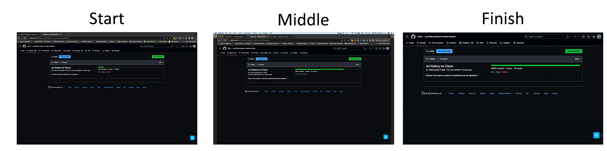

------------------------------------------------------------------------------------
### Please note: I am first language is ISL (Irish Sign Language). Despite writing in English as a second language.
____________________________________________________________
* Introducing the [Ahrefs Writing Tools Product Description Generator]( https://ahrefs.com/writing-tools/product-description-generator), a powerful tool designed to assist non-native English speakers in crafting professional and polished product descriptions. While subscriptions to this tool can be costly, it has proven to be an invaluable resource for those seeking to improve their English writing skills. With the ability to write and translate English clearly and concisely, users can confidently create product descriptions that are both informative and engaging. Whether you are a business owner or a content creator, the Ahrefs Writing Tools Product Description Generator is a must-have tool for anyone looking to enhance their English writing abilities.

* Above I used that one for a site development project for Art Gallery.

* Unfortunately, It is not perfect to write because it did not meet of my demonstration for Readme. I had to write in my second English language and copy and paste in the AI generator then make editing instead. 

* I hope you read and understand the ReadMe.
------------------------------------------------------------------------------------
## Agile management

* The concept introduced for the Art Gallery project, is a comprehensive solution for selling fine art frame. Developed through a 18-stages process utilising Agile management, this project was completed. 

* The Agile management can find the link at [Robert’s Github](https://github.com/RQISL/portfolio-project-5-robert-quinlan/issues?q=is%3Aissue+is%3Aclosed) and [Github milestone](https://github.com/RQISL/portfolio-project-5-robert-quinlan/milestones) and milestone showcases the screenshots of progress made from start to finish below:

* ### Agile Management:

* 
    

        
Click here to see the board:

        
    

* 
    

        
Click here to see the from start, middle and finish on the milestones:

        
    

## Concept Project

* our innovative Art Gallery project, designed to support talented fine artists like my good friend. With a focus on providing a platform for artists to showcase their work, our gallery aims to connect artists with potential clients. As part of our commitment to excellence, we also offer consultation services to clients, allowing them to gain valuable experience in working with artists and selecting artwork that resonates with their preferences. 

- The project's development follows below:

## Flowchart 
* ### Design of the navbar links flowchart:
* 
    

    
Click here to see the flowchart with web market

    
    

-------------------------------------------------------------------------------------------------
# Create design UX for the Art Gallery site

*  The RZ Collection website showcases stunning and seamless layout transitions that have inspired me during my exploration. The user experience (UX) on this site is truly remarkable, prompting me to develop my own UX concept. However, creating a design UX requires a significant amount of time, which unfortunately poses a challenge.

# Wireframe 

* # Design wireframe UX for Desktop & Mobile
* A design UX that is almost similar to the one developed for the site. Please note that while the design UX may not be exact, it is still of the highest quality and has been developed with utmost care and attention to detail. 

* ## Desktop

* ## Mobile

## Moodboard
* The moodboard is a visual arrangement of images, materials, and text that aims to evoke a specific style or concept. It serves as a helpful tool to clearly visualize the design direction for the website. In this particular moodboard, I have included labeled images for the hero cover background, color palettes, and the font choice of Roboto for all the text, while using Agbalumo for the head title and logo. 

* Please note that the logo was conceptualized and created separately, and you can find a link to it here. The moodboard was created using the Adobe Illustrator app. Please refer to the image below for a visual representation.

## Colour Palette

* This moodboard features a visually appealing background cover image with a combination of dark grey, pink, and blue color palettes. However, to enhance the contrast, we have made a modification by replacing the colors with bright green and dark green. The new color scheme creates a pleasant and friendly aesthetic, making it more visually appealing. Please refer to the attached image for a better understanding.

* 
    

            
Click here to see colour palette

            
    

-------------------------------------------------------------------------------------------------------      
# Design and development the Art Gallery for desktop & mobile devices

* This logo is a unique art painting that features spot color and brush strokes. The painting is designed with the full name of the artist, who is known for her talent in fine art.

* 

Features
-------------
* The Art Gallery is a platform dedicated to showcasing and selling fine art paintings. The owner, a talented painter herself, operates a studio where she creates her own artwork. In addition to selling her pieces on the website, she also offers her services to customers who are interested in commissioning personalized artwork. This includes working with individuals with intellectual disabilities, children, and anyone else who may benefit from her artistic expertise.

### Mock-up Responsive Screens as seen attached here:

Existing Features
-----------------------
### Navigation Bar

* Introducing our user-friendly header menu, a convenient navigation tool for our website. This menu consists of 7 pages, including Home, About, Category Painting, My Account (which includes register and login options), and Contact. With this menu, you can easily explore our website and find the information you need. For a visual representation of the website's structure, please refer to the attached [Flowchart](#flowchart).

* Additionally, our header menu offers CRUD functionality, allowing the site owner to modify it according to their preferences. This feature is especially beneficial for artists who are selling their artwork while using the website for their creative endeavors.

### Navbar
*  This product features a convenient clickable toggle bar located at the top left corner. With a simple click, the toggle bar smoothly slides from left to right, providing easy access to various sections such as Home, About, Category Painting, Shop, Search, My Account (including register and login), and contact. Take a look at the accompanying screenshot for a visual representation of this user-friendly navigation system.

* Head navbar

* Open from left to right menu

## The picture below:

## Home page
 
* The home page of this product provides a comprehensive overview of the individual, highlighting her identity and providing information about herself. Additionally, the page concludes with a clickable button that directs users to her past exhibitions page, allowing them to explore her previous works and experiences.

    

        
Click here to see Home page

        
    

## About Us page

* The About Us page provides a comprehensive overview of our site, highlighting our focus on selling exquisite fine art pieces. It also delves into the founder's personal experience with artwork, offering a deeper connection to the gallery. To facilitate communication, a convenient clickable button is available, directing customers to the contact page. Whether they wish to hire, request specific artwork, or simply get in touch, this feature ensures a seamless and efficient interaction. Please refer to the attached screenshot for a visual representation.

    

            
Click here to see about us page

            
    

## Category Painting page

* This product offers a wide range of fine art categories for users to choose from, including nude, landscape, and cutie paintings such as Christmas, animal, display of collections, and patches. Additionally, the painter owner has the flexibility to create their own categories based on their preferences. With this product, customers can explore and enjoy a diverse selection of artistic styles and themes.

    

        
Click here to see category painting page

        
    

## Shop

* Our online shop offers a convenient way for art enthusiasts to browse through all our art galleries in one page.
* Customers can easily sort the galleries based on their preferred price range, with the option to choose from low to high prices.
* Additionally, customers can also sort the galleries alphabetically from Z to A or choose other sorting options that suit their preference.
* With our user-friendly shop page, customers can easily find the perfect artwork that fits their budget and taste.

    

        
Click here to see Shop page

        
    

## Search art gallery
*  The search page, the users can looking for type of art gallery.

1. 
     

        
Click here to see Search page

        
    

1. 
     

        
Click here to see type in search page

        
    

1. 
    

        
Click here to see result page

        
    

1. 
    

        
Click here to see option low to high prices sort page

        
    

## My Account page
* This product offers a user-friendly interface where customers can easily access their account by clicking on the "My Account" option. They will be presented with the choice to either register or login. Once logged in, customers will have access to their profile and the option to logout for added security.

* On the owner's side, the "My Account" section provides comprehensive product management capabilities along with profile settings and logout functionality. Admin users will have the ability to perform CRUD operations, including creating, reading/editing, updating, and deleting products. These actions will be seamlessly displayed on the site through intuitive buttons, ensuring efficient management of the site's content.

* The profile can only be updated by the user or owner, with the exception of the address field which can be changed by either party. Our product ensures efficient and secure account management for all users.
1. 
    

        
Click here to see from left to right menu

        
    

1. 
    

        
Click here to see Sign Up page menu

        
    

1. 
    

        
Click here to see verify_email page

        
    

1. 
    

        
Click here to see disposable email temporary

        
    

1. 
    

        
Click here to see confirm email page

        
    

1. 
    

        
Click here to see confirm email with success message

        
    

1. 
    

        
Click here to see login with success page

        
    

1. 
     

        
Click here to see menu My account include profile & Logout page

        
    

## Contact page
* Our product provides customers with a wide range of categories to choose from, including "hire me," "general request," "photo to painting," and "design for sign language."
* With our user-friendly site, Ower's side have the flexibility to modify, create, edit, or delete their desired content.
* Our product empowers customers to personalise their requests and transform their photos into beautiful paintings, providing a customised experience to suit their needs.
1. 
    

        
Click here to see category contact page

        
    

1. 
    

        
Click here to see contact form page

        
    

## Footer 

* Enhance user experience with our innovative product featuring a "Click here for more information" button at the bottom. As users scroll up, a seamless fade-in effect captures their attention, inviting them to click. Once clicked, the content smoothly slides up to occupy the full screen, providing a comprehensive view. Additionally, users can conveniently access Facebook or subscribe to our newsletter, ensuring they stay connected and up-to-date with the latest updates and promotions.
1. 
    

        
Click here to see footer page at the bottom of the button

        
    

1. 
     

        
Click here to see footer page full slide up

        
    

# Site Administration

* You will be able to access the administration page at [Art Gallery](https://art-gallery-elena-d4d9090ab15b.herokuapp.com/admin/login/?next=/admin/) site. I will give instructions when you receive my submission.

* This product offers a comprehensive solution for website owners, providing both a user-friendly site and an administration site for easy management. Only owners have access to the administration site, where they can make edits to the website if desired. By logging into the administration site and selecting "view site on the top right," users will find a range of buttons such as "add," "edit," or "delete." 

* These buttons allow owners to make changes to various sections of the website, including Home, About, Category Painting, Shop, My Account - Product Management, and Contact.

1. 
    

        
Click here to see example button add, edit or delete page

        
    

1. 
     

        
Click here to see example home page edit

        
    

## Testing browser compatibility

* Our comprehensive testing service guarantees browser compatibility across a wide range of popular browsers, such as Safari, Google Chrome, Opera, and Firefox. With our rigorous testing process, you can be confident that your website or application will function seamlessly across these platforms.

* Microsoft Edge, 2. Unfortunately, if you are experiencing issues with Microsoft Edge on your laptop, it may be due to compatibility problems with older versions.

* To fully enjoy the benefits of Microsoft Edge, we recommend using it on a more up-to-date laptop that meets the system requirements. Upgrade your device to unlock the full potential of this innovative web browser and enjoy a faster, safer, and more efficient browsing experience.

* As an example, we have conducted extensive testing using the Safari browser, ensuring that your website is fully responsive and optimized for this specific platform. You can refer to the attached screenshot to see the exemplary results of our testing.

* While we thoroughly test for compatibility on various browsers, it is important to note that there may be slight variations in the appearance or functionality of certain elements. In the case of a minor discrepancy, such as a button placement in the bottom footer, we have made a conscious decision to maintain the original style without making any changes. Rest assured, this will not affect the overall user experience or functionality of your website.
1. 
    

        
Click here to see Safari for Desktop

        
    

1. 
     

        
Click here to see Safari for tablet

        
    

1. 
     

        
Click here to see Safari mobile

        
    

## The lighthouse runs testing and results.

* This [Page Speed Insights](https://pagespeed.web.dev/analysis/https-art-gallery-elena-d4d9090ab15b-herokuapp-com/3fwzmsh2yy?form_factor=desktop). is a test tool that analyzes the performance of a website on both desktop and mobile devices. It provides insights and recommendations based on the results obtained from running the test.

* The test results indicate that the mobile performance of the analyzed website is relatively low, suggesting potential areas for improvement. It has been proven to improve website results, even in cases where responsive images have caused performance issues. I have decided not to pursue further fixes due to time constraints.

* ### See attached result both Desktop & Mobile:

1. 
     

        
Click here to see the result of Desktop preformance

        
    

1. 
     

        
Click here to see the result of mobile preformancee

        
    

## Validation testing

### HTML
* Run testing used [The 3WC HTML Validator](https://validator.w3.org/) for Home, About Us, Category Painting, Shop, Search Product, The product Management, Profile, Login, Sign-up, Logout, and Contact pages have been meticulously reviewed and corrected to ensure optimal functionality. Our overlay model login and signup buttons remain unchanged. All passed!

### CSS
* Run testing used [the official (Jigsaw) validator](https://jigsaw.w3.org/css-validator/) for CSS. It was all passed and no errors.

### Python

* [The CI Python Linter](https://pep8ci.herokuapp.com/#) is a powerful tool designed to identify and fix errors in Python code. With its extensive testing capabilities, it thoroughly scans your code and provides detailed feedback on any issues it finds. While it successfully resolves most errors, there may be a few instances where it is unable to make the necessary corrections. Additionally, there have been occasional issues with the tool causing errors when running the site. However, despite these minor setbacks, the CI Python Linter remains a reliable and effective solution for ensuring the quality and correctness of your Python code.

### The devices

* iPhone reviewed and corrected to ensure optimal functionality and it looks good.

## Credits

*  Our concept art gallery site, designed specifically for art enthusiasts and collectors, we offer a unique consulting experience tailored to her needs. Whether you're a first-time client or a close friend, our personalized approach ensures a seamless collaboration. With a focus on showcasing timeless art pieces, our gallery offers a diverse collection of old masterpieces. However, we understand the importance of staying current, and we are committed to updating and enhancing the site to meet her evolving preferences. When the time is right, we look forward to assisting you in showcasing your own artwork after she busy schedule with your child.

* Please find Agile management [Consult with a client](https://github.com/RQISL/portfolio-project-5-robert-quinlan/issues/7) as you can see when we were consulted up to date. 

* Our mentor advised me where my concept can challenge and learn from mistakes, easily manage projects and avoid unnecessary complications. Take control of the development process and achieve success. It was more complications than you expected. Also He was exellent tutorial with me a few sessions. 

# Deployment

[The Heroku app page](https://www.heroku.com/) where is deployed. How do processing the site deployed as follows:

* Login 
* use the Google Authenticator app and open the screen display of the code number 
and Verify Your Identity page "Verification Code" and insert the code in the box 
then click on Verify button. 
* Click on the button "Create new app" 
* Type in the box “project-4-order-foods”
* Select Europe
* Click on the "Create app" button
* To click "art-gallery-elena" to open
* Click on "Deploy" on the top menu
* On RQISL next to the box copy from GitHub <https://github.com/RQISL/portfolio-project-5-robert-quinlan> to paste onto the box then click on to "search" button 
* prompt shows the link active then click on the "connect" button
* Make sure to check the "Enable Automatic" button is on
* click on the "Deploy Branch" button
* Prompts active on the screen until the completed
* Click on the "View" button to open the page

### The deployed site is now live [Art Galeery](https://art-gallery-elena-d4d9090ab15b.herokuapp.com/)

## Resource & tutorial
* ### I learned as many resources as possible I learned how to use Create for the cart, profile, and CRUD.

### Resources and tutorials:

* Most of time I learned walkthrough at Aoutique Ado as it follows on my project 5 but mostly, all I made modified the way of site I created. I had quite improved familar with Django and I enjoyed but it needs further experiance improve my skills in the feild of Django. 

## Technologies Used

1) [Gitpod](https://gitpod.io) I have used it since the beginning of the project 5

2) The [The CI Python Linter](https://pep8ci.herokuapp.com/#) is a powerful tool that allows you to run tests and identify errors in your Python code. By using this linter, you can easily fix any bugs and ensure the quality of your code. Additionally, I found [Code Beautify](https://codebeautify.org/python-formatter-beautifier#) to be extremely helpful in reducing stress and quickly identifying errors. This Python formatter and beautifier simplifies the process of finding and fixing errors. Simply copy and paste your code into the CI Python Linter, and it will highlight any errors for you to address. However, please note that some code may still have errors that cannot be changed to avoid any issues with the site.

3) [Heroku app](https://www.heroku.com/) - The deployed to active the browser.

5) [3WC HTML Validator](https://validator.w3.org/) - Run testing any errors to be fix the bugs

6) [3WC CSS Validator](https://jigsaw.w3.org/css-validator/)  - Run testing any errors to be fix the bugs

7) [Free Licence download images](https://www.vecteezy.com/free-photos/meal?page=2 )  - I used download for free licence images.

8) [Bootstraps 5](https://getbootstrap.com/docs/5.0/getting-started/introduction/ )  - I used bootstrap 5.

9) Adobe Illustrator - I use for design logo.

10) Adobe Photoshop - I use for edit images.

## Concluded 

*  Our site is the perfect place for me to learn and grow in my skills. With a user-friendly interface and a wide range of resources, I'll find everything I need to succeed.

*  Unlike Project 4, our site is designed to make learning easy and enjoyable. I'll have access to expert instructors, engaging content, and a supportive community of learners.

* Art Gallery, a concept project brought to life. Visit the site [Art Gallery](https://art-gallery-elena-d4d9090ab15b.herokuapp.com/).

