------------------------------------------------------------------------------------
## Please note: My first language is Irish Sign Language, and English is my second language.
------------------------------------------------------------------------------------

* The [Ahrefs Writing Tools Product Description Generator]( https://ahrefs.com/writing-tools/product-description-generator) is a powerful tool specifically designed to assist non-native English speakers in creating professional and polished product descriptions. It has proven to be an invaluable resource for individuals looking to improve their English writing skills, despite the cost of subscriptions. With its ability to write and translate English clearly and concisely, users can confidently produce informative and engaging product descriptions. Whether you are a business owner or a content creator, the Ahrefs Writing Tools Product Description Generator is an essential tool for enhancing your English writing abilities.
* This particular tool was utilized in a site development project for an Art Gallery, showcasing its versatility and applicability across various industries.
* Although the tool did not meet the requirements for my demonstration in the ReadMe, I was able to work around it by writing in my second language and then editing the generated content from the AI generator.
* I sincerely hope that you have taken the time to read and understand the ReadMe document.
------------------------------------------------------------------------------------
## Agile management

* The concept introduced for the Art Gallery project is a comprehensive solution for selling fine art frames. Developed through an 18-stage process utilising Agile management, this project was completed. 

* The Agile management can find the link at [Robert’s Github](https://github.com/RQISL/portfolio-project-5-robert-quinlan/issues?q=is%3Aissue+is%3Aclosed) and [Github milestone](https://github.com/RQISL/portfolio-project-5-robert-quinlan/milestones) and milestone showcases the screenshots of progress made from start to finish below:

* ### Agile Management:

* 
    

        
Click here to see the board:

        
    

* 
    

        
Click here to see them from start, middle and finish on the milestones:

        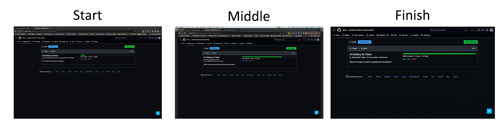
    

## Concept Project

* our innovative Art Gallery project, designed to support talented fine artists like my good friend. With a focus on providing a platform for artists to showcase their work, our gallery aims to connect artists with potential clients. As part of our commitment to excellence, we also offer consultation services to clients, allowing them to gain valuable experience in working with artists and selecting artwork that resonates with their preferences. 

- The project's development follows below:

## Flowchart 
* ### Design of the navbar links flowchart:
* 
    

    
Click here to see the flowchart with web market

    
    

-------------------------------------------------------------------------------------------------
# Create design UX for the Art Gallery site

*  [The RZ Collection](https://rzcollection.com/artists/ilgvars-zalans) website showcases stunning and seamless layout transitions that have inspired me during my exploration. The user experience (UX) on this site is truly remarkable, prompting me to develop my own UX concept. However, creating a design UX requires a significant amount of time, which unfortunately poses a challenge.

# Wireframe 

* # Design wireframe UX for Desktop & Mobile
* A design UX that is almost similar to the one developed for the site. Please note that while the design UX may not be exact, it is still of the highest quality and has been developed with utmost care and attention to detail. 

* ## Desktop

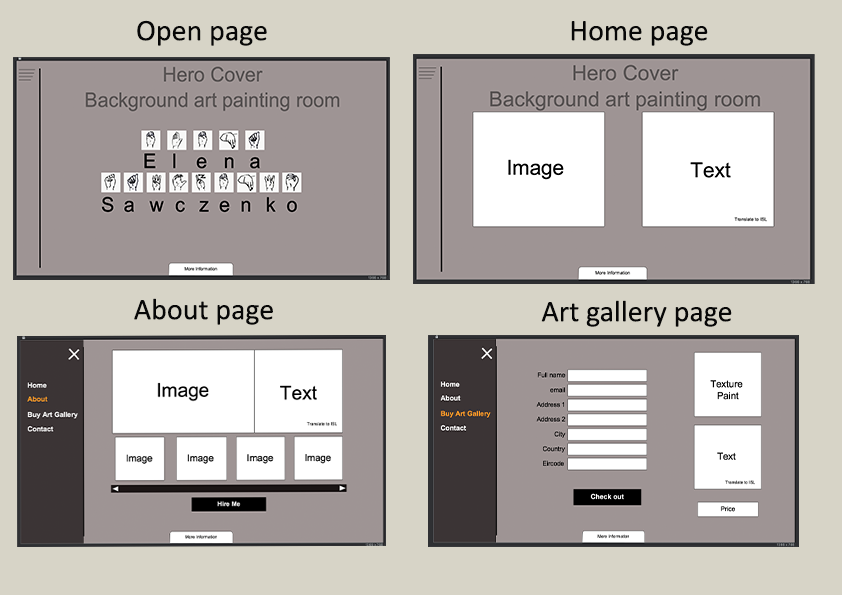
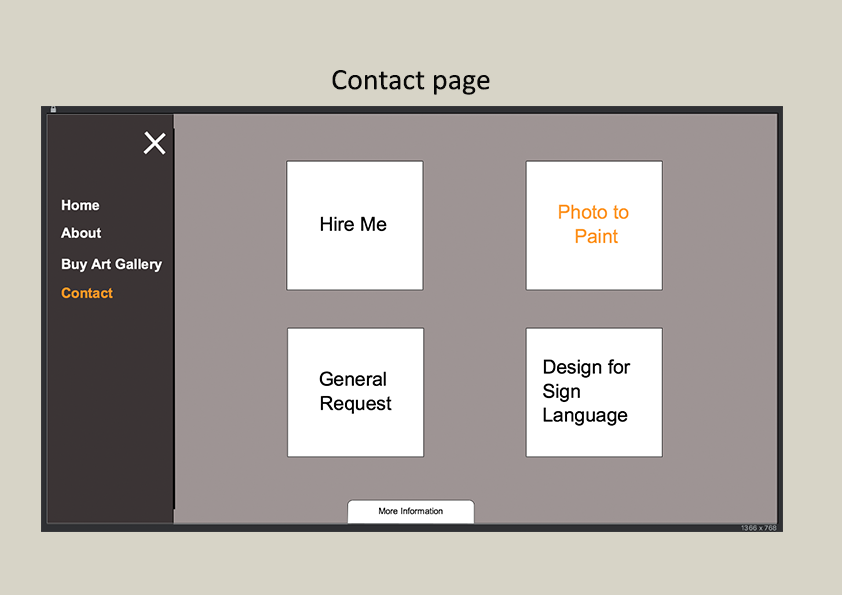

* ## Mobile

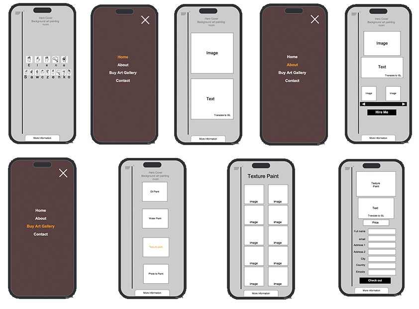
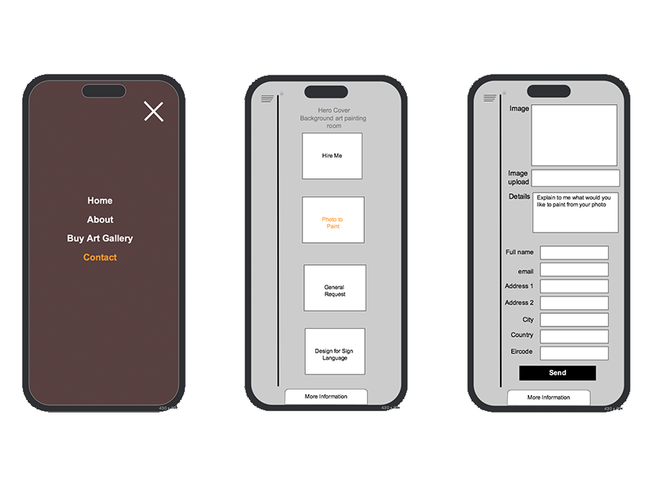

## Moodboard
* The moodboard is a visual arrangement of images, materials, and text that aims to evoke a specific style or concept. It serves as a helpful tool to visualise the design direction for the website. In this particular moodboard, I have included labeled images for the hero cover background, color palettes, and the font choice of Roboto for all the text, while using Agbalumo for the head title and logo. 

* Please note that the logo was conceptualized and created separately, and you can find a link to it here. The moodboard was created using the Adobe Illustrator app. Please refer to the image below for a visual representation.

## Colour Palette

* This moodboard features a visually appealing background cover image with a combination of dark grey, pink, and blue color palettes. However, to enhance the contrast, we have modified it by replacing the colors with bright green and dark green. The new color scheme creates a pleasant and friendly aesthetic, making it more visually appealing. Please refer to the attached image for a better understanding.

* 
    

            
Click here to see colour palette

            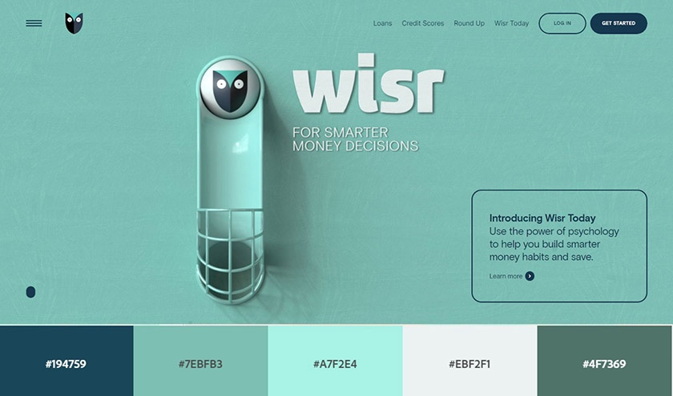
    

----------------------------------------------------------------------------------------------------- 
# Design and development of the Art Gallery for desktop & mobile devices

* This logo is a unique art painting that features spot color and brush strokes. The painting is designed with the full name of the artist, who is known for her talent in fine art.

* 

Features
-------------
* The Art Gallery is a platform dedicated to showcasing and selling fine art paintings. The owner, a talented painter herself, operates a studio where she creates her artwork. In addition to selling her pieces on the website, she also offers her services to customers who are interested in commissioning personalized artwork. This includes working with individuals with intellectual disabilities, children, and anyone else who may benefit from her artistic expertise.

### Mock-up Responsive Screens as seen attached here:

Existing Features
-----------------------
### Navigation Bar

* Introducing our user-friendly header menu, a convenient navigation tool for our website. This menu consists of 7 pages, including Home, About, Category Painting, My Account (which includes register and login options), and Contact. With this menu, you can easily explore our website and find the information you need. For a visual representation of the website's structure, please refer to the attached [Flowchart](#flowchart).

* Additionally, our header menu offers functionality, allowing the site owner to modify it according to their preferences. This feature is especially beneficial for artists who are selling their artwork while using the website for their creative endeavors.

### Navbar
*  This product features a convenient clickable toggle bar located at the top left corner. With a simple click, the toggle bar smoothly slides from left to right, providing easy access to various sections such as Home, About, Category Painting, Shop, Search, My Account (including register and login), and Contact. Take a look at the accompanying screenshot for a visual representation of this user-friendly navigation system.

* Head navbar

* Open from left to right menu

## The picture below:

## Home page
 
* The home page of this product provides a comprehensive overview of the individual, highlighting her identity and providing information about herself. Additionally, the page concludes with a clickable button that directs users to her past exhibitions page, allowing them to explore her previous works and experiences.

    

        
Click here to see Home page

        
    

## About Us page

* The About Us page provides a comprehensive overview of our site, highlighting our focus on selling exquisite fine art pieces. It also delves into the founder's personal experience with artwork, offering a deeper connection to the gallery. To facilitate communication, a convenient clickable button is available, directing customers to the contact page. Whether they wish to hire, request specific artwork, or simply get in touch, this feature ensures a seamless and efficient interaction. Please refer to the attached screenshot for a visual representation.

    

            
Click here to see about us page

            
    

## Category Painting page

* This product offers a wide range of fine art categories for users to choose from, including nude, landscape, and cutie paintings such as Christmas, animal, display of collections, and patches. Additionally, the painter owner has the flexibility to create their categories based on their preferences. With this product, customers can explore and enjoy a diverse selection of artistic styles and themes.

    

        
Click here to see the category painting page

        
    

## Shop

* Our online shop offers a convenient way for art enthusiasts to browse through all our art galleries on one page.
* Customers can easily sort the galleries based on their preferred price range, with the option to choose from low to high prices.
* Additionally, customers can also sort the galleries alphabetically from Z to A or choose other sorting options that suit their preferences.
* With our user-friendly shop page, customers can easily find the perfect artwork that fits their budget and taste.

    

        
Click here to see Shop page

        
    

## Search art gallery
*  The search page, the users can be looking for the type of art gallery.

1. 
     

        
Click here to see Search page

        
    

1. 
     

        
Click here to see type in search page

        
    

1. 
    

        
Click here to see result page

        
    

1. 
    

        
Click here to see the option low to high prices sort page

        
    

## My Account page
* This product offers a user-friendly interface where customers can easily access their accounts by clicking on the "My Account" option. They will be presented with the choice to either register or login. Once logged in, customers will have access to their profile and the option to logout for added security.

* On the owner's side, the "My Account" section provides comprehensive product management capabilities along with profile settings and logout functionality. Admin users will have the ability to perform CRUD operations, including creating, reading/editing, updating, and deleting products. These actions will be seamlessly displayed on the site through intuitive buttons, ensuring efficient management of the site's content.

* The profile can only be updated by the user or owner, except for the address field which can be changed by either party. Our product ensures efficient and secure account management for all users.

* Exciting news! We now offer the option to order an art gallery without signing up. We understand that some users prefer not to use their profiles, so we've made it hassle-free for you. Simply place your order and we'll send all the details directly to your email. No sign-up is required! Enjoy our art gallery experience effortlessly.
1. 
    

        
Click here to see from left to right menu

        
    

1. 
    

        
Click here to see the Sign Up page menu

        
    

1. 
    

        
Click here to see verify_email page

        
    

1. 
    

        
Click here to see disposable email temporary

        
    

1. 
    

        
Click here to see confirm email page

        
    

1. 
    

        
Click here to see confirm email with success message

        
    

1. 
    

        
Click here to see login with success page

        
    

1. 
     

        
Click here to see menu My account include profile & Logout page

        
    

## Contact page
* Our product provides customers with a wide range of categories to choose from, including "hire me," "general request," "photo to painting," and "design for sign language."
* With our user-friendly site, Ower's side has the flexibility to modify, create, edit, or delete their desired content.
* Our product empowers customers to personalise their requests and transform their photos into beautiful paintings, providing a customised experience to suit their needs.
1. 
    

        
Click here to see the category contact page

        
    

1. 
    

        
Click here to see contact form page

        
    

## Footer 

* Enhance user experience with our innovative product featuring a "Click here for more information" button at the bottom. As users scroll up, a seamless fade-in effect captures their attention, inviting them to click. Once clicked, the content smoothly slides up to occupy the full screen, providing a comprehensive view. Additionally, users can conveniently access Facebook or subscribe to our newsletter, ensuring they stay connected and up-to-date with the latest updates and promotions.
1. 
    

        
Click here to see the footer page at the bottom of the button

        
    

1. 
     

        
Click here to see the footer page full slide up

        
    

# Site Administration

* You will be able to access the administration page at [The Art Gallery](https://art-gallery-elena-d4d9090ab15b.herokuapp.com/admin/login/?next=/admin/) site. I will give instructions when you receive my submission.

* This product offers a comprehensive solution for website owners, providing both a user-friendly site and an administration site for easy management. Only owners have access to the administration site, where they can make edits to the website if desired. By logging into the administration site and selecting "view site on the top right," users will find a range of buttons such as "add," "edit," or "delete." 

* These buttons allow owners to make changes to various sections of the website, including Home, About, Category Painting, Shop, My Account - Product Management, and Contact.

1. 
    

        
Click here to see an example button to add, edit or delete page

        
    

1. 
     

        
Click here to see an example home page edit

        
    

# Manual Testing

* Our product is a comprehensive project management tool that incorporates Agile management principles into its 18-stage board system.

* With a focus on continuous improvement, our platform allows for the seamless addition of new features based on user feedback and evolving project requirements.

* In addition, our product comes with a detailed manual testing process to ensure the highest level of quality and reliability for our users.

### 1. Navigation Bar

* As **<u>HTML, Django, and Bootstrap</u>**  I can **create **the **menu**** for the** vertical</u>** So that **<u>the **user clicks on the toggle** button to open on the vertical to right,</u>**

| Feature | Action | Expected Result | Actual Results |
|---------|--------|-----------------|----------------|
| Navigation Bar| <ol> <li>Dash button</li> <li>Click to Logo</li> <li>Click to basket</li> <li>In checkout page</li> </ol> | <ol> <li>User click to open the vertial on leftside to right</li> <li>User click to logo to get back to home page</li> <li>User click to basket and to checkout page as empty basket, which the user does not any order yet</li> <li>User click to 'Keep Shopping' button, which the user can contuine purchases</li></ol> |<ol> <li>Works as expected</li> <li>Works as expected</li> <li>Works as expected</li> <li>Works as expected</li> </ol> |

### Please refer to the numbers in the order shown above the table in the images.
### Navigation Bar
1. 
    

        
Click here to see the screenshot

        
        
    

1. 
     

        
Click here to see the screenshot

        
    

1. 
     

        
Click here to see screenshot

        
        
    

1. 
     

        
Click here to see the screenshot

        
        
    

### 2. Home Page 

* As **<u>HTML</u>** I can create **<u>an image **of the client's portrait photo** and text & translate ISL video</u>** So that **<u>amount the **client information about her talent Fine Art</u>**
* As **<u>text & translate ISL video:**</u> Due to unforeseen circumstances, we have decided to cancel the video ISL translation and will only provide the text version.

| Feature | Action | Expected Result | Actual Results |
|---------|--------|-----------------|----------------|
| Dash button| <ol> <li>Open vertical to right</li> </ol> | <ol> <li>User click 'Home' and activate to Home page </li> <li>User click 'visit her exhibition' on the button and activate to 'visit her exhibition' page</li> </ol> | <ol> <li>Works as expected</li> <li>Works as expected</li> </ol> |

### Please refer to the numbers in the order shown above the table in the images.

1. 
    

        
Click here to see the screenshot

        
        
    

1. 
     

        
Click here to see the screenshot

        
        
    

### 3. About Page 

* As **<u>HTML</u>** I can create **<u>the about page of the client's talent Fine Art with portrait and text & translate ISL video</u>** So that **<u>shows the client's former work varies** art</u>**

* As **<u>text & translate ISL video:**</u> Due to unforeseen circumstances, we have decided to cancel the video ISL translation and will only provide the text version.

| Feature | Action | Expected Result | Actual Results |
|---------|--------|-----------------|----------------|
| Dash button| <ol> <li>Open vertical to right</li> </ol> | <ol> <li>User click 'About' and activate to About page </li> <li>User click 'visit contact page' on the button and activate to 'Contact' page</li> </ol> | <ol> <li>Works as expected</li> <li>Works as expected</li> </ol> |

### Please refer to the numbers in the order shown above the table in the images.

1. 
    

        
Click here to see the screenshot

        
        
    

1. 
     

        
Click here to see the screenshot

        
        
    

### 4. Category Painting Page 

* As **<u>HTML, Python, Django, and Allauth</u>** I can create **buy an **art gallery including Allaut** So that **<u>the user or company can buy a fine art gallery</u>**

1) There are four categories in the art group: Water Paint, Texture Paint, Oil Paint and Pencil Drawing. 
1) Each art gallery allows you to select and roll over to display the relevant information.
1) Additionally, you can add items to your basket and display them on the checkout page. 
1) On the checkout page, you'll need to fill in your address and indicate whether you would like to add a profile or not.

**<u>Please note as above mention No.1:**</u> Please note that before consulting with my client, I revised my concept project for the painting category. I changed it to include landscapes, nudes, and other themes. This was done while I collected her previous paintings from galleries through her photography.

| Feature | Action | Expected Result | Actual Results |
|---------|--------|-----------------|----------------|
| Dash button| <ol> <li>Open vertical to right</li> </ol> | <ol> <li>User click 'Category Painting' and activate to category painting page </li> <li>User click any button on category painting page and activate to Art Gallery page</li> </ol> | <ol> <li>Works as expected</li> <li>Works as expected</li> </ol> |
| Art Gallery Page | <ol> <li>Activate to art gallery page</li> </ol> | <ol> <li>User click any 'View Frame' on page and activate to add to bag page</li> <li>User click 'Add to bag' button</li><li>Alert box pop up</li> <li>User click to 'Secure Checkout' on the alert box</li> </ol> | <ol> <li>Works as expected</li> <li>Works as expected</li> <li>Works as expected</li> <li>Works as expected</li></ol> |
| Checkout Page | <ol> <li>Activate to checkout page</li> </ol> | <ol> <li>User click either 'Keep Shopping' or 'Secure Checkout' buttons</li> <ul><li>If User click to 'Secure Checkout' button and activate checkout form page</li> <li>If User click to 'Keep Shopping' button and activate category painting page</li></ul> <li>User fill the form</li><li>User make payment</li> <li>User click either 'Adjust Bag' or 'Complete Order' buttons</li> <ul><li>If User click to 'Adjust Bag' button and activate checkout page</li> <li>If User click to 'Complete Order' button and activate thank you page</li> </ul> <li>Alert box pop up after the complete order</li></ol> | <ol> <li>Works as expected</li> <ul><li>Works as Expected</li> <li>Works as Expected</li> </ul> <li>Works as expected</li> <li>Works as expected</li> <li>Works as expected</li> <ul><li>Works as Expected</li> <li>Works as Expected</li> </ul> <li>Works as expected</li> </ol> |

### Please refer to the numbers in the order shown above the table in the images.

#### 1. Dash Button

1. 
    

        
Click here to see the screenshot

        
        
    

1. 
     

        
Click here to see the screenshot

        
        
    

#### 2. Art Gallery Page

1. 
    

        
Click here to see the screenshot

        
        
    

1. 
     

        
Click here to see the screenshot

        
    

1. 
    

        
Click here to see the screenshot

        
    

1. 
    

        
Click here to see the screenshot

        
    

#### 3. Checkout Page

1. 
    

        
Click here to see the screenshot

        
    

    *   

                
Click here to see the screenshot

                
        

    *   

                
Click here to see the screenshot

                
        

1. 
     

        
Click here to see the screenshot

        
    

1. 
    

        
Click here to see the screenshot

        
    

1. 
    

        
Click here to see the screenshot

        
    

    *   

                
Click here to see the screenshot

                
        

    *   

                
Click here to see the screenshot

                
        

1. 
     

        
Click here to see the screenshot

        
    

### 5. Shop Page 

* As **<u>HTML</u>** I can create **<u>a shop page</u>** So that **<u>for users to browse and purchase art from an art gallery.</u>**

* **<u>Please note:**</u> that I did not include this feature in the user stories on the Agile management board while developing the site, but decided to use shop on the page.

<table style="width:100%">
    <thead>
        <tr>
            <th>Feature</th>
            <th>Action</th>
            <th>Expected Result</th>
            <th>Actual Results</th>
        </tr>
    </thead>
    <tbody>
        <tr>
            <th colspan="4">Below are the steps to complete a shopping transaction on our website. Please note that you can click on the various buttons and links to navigate the website.</th>
        </tr>
        <tr>
            <td rowspan=24>Dash button</td>
            <td rowspan=24>Open vertical to right</td>
            <td>1. Start by clicking on the 'Shop' button which will take you to the Shop page.</td>
            <td>Works as Expected</td>
        </tr>
        <tr>
            <td>2. On the Art gallery page, click on any 'View Frame' button to view the details of the product.</td>
            <td>Works as Expected</td>
        </tr>
        <tr>
            <td>3. From there, you can add the product to your cart by clicking on the 'Add to Bag' button on the Add to Bag page. You can then increase or decrease the quantity by clicking on the minus or plus button.</td>
            <td>Works as Expected</td>
        </tr>
        <tr>
            <td>4. Once you're done, click on the 'Add to bag' button and a pop-up box will appear confirming that the item has been successfully added to your cart.</td>
            <td>Works as Expected</td>
        </tr>
         <tr>
            <td>5. To proceed to checkout, click on the 'Secure Checkout' button.</td>
            <td>Works as Expected</td>
        </tr>
        <tr>
            <td>6. If you want to update the quantity of the item, click on the 'Update' button and a pop-up box will appear confirming that the item has been successfully updated.</td>
            <td>Works as Expected</td>
        </tr>
        <tr>
            <td>7. If you want to remove the item from your cart, click on the 'Remove' button and a pop-up box will appear confirming that the item has been successfully removed.</td>
            <td>Works as Expected</td>
        </tr>
        <tr>
            <td>8.  If you want to continue shopping, click on the 'Keep Shopping' button to go back to the Shop page.</td>
            <td>Works as Expected</td>
        </tr>
        <tr>
            <td>9. To view your cart, click on the 'Basket' button located in the top right corner of the page.</td>
            <td>Works as Expected</td>
        </tr>
        <tr>
            <td>10. To proceed to checkout, click on the 'Secure Checkout' button.</td>
            <td>Works as Expected</td>
        </tr>
        <tr>
            <td>11. Fill out the form on the checkout page with your personal</td>
            <td>Works as Expected</td>
        </tr>
        <tr>
            <td>12. You can choose to create an account by clicking on the 'Create an account' button and filling out the form. If you already have an account, you can login by clicking on the 'login' button.</td>
            <td>Works as Expected</td>
        </tr>
        <tr>
            <td>13. Once you have completed your purchase, you will receive an email confirming your order. You will be prompted to click on a link to confirm your email address and then click the 'Confirm' button.</td>
            <td>Works as Expected</td>
        </tr>
        <tr>
            <td>14. Once you have confirmed your email address, you will be redirected to the website, and an alert will appear confirming your successful login.</td>
            <td>Works as Expected</td>
        </tr>
        <tr>
            <td>15. To view your order history, click on the 'Back to Profile' button and you will be directed to your profile page where you can view your order history and update your address if necessary.</td>
            <td>Works as Expected</td>
        </tr>
        <tr>
            <td>16. If you want to reorder a previously purchased item, click on the link in the order history and it will take you to a 'Thank you' page with the details of the order.</td>
            <td>Works as Expected</td>
        </tr>
        <tr>
            <td>17. On the Shop page, users can sort items by selecting a sorting option from the dropdown menu labeled 'Sort by...'</td>
            <td>Works as Expected</td>
        </tr>
        </tbody>
    </table>

### Please refer to the numbers in the order shown above the table in the images.

#### Shop Page
1. 
    

        
Click here to see the screenshot

        
        
    

1. 
     

        
Click here to see the screenshot

        
        
    

1. 
    

        
Click here to see the screenshot

        
        
    

1. 
    

        
Click here to see the screenshot

        
    

1. 
     

        
Click here to see the screenshot

        
    

1. 
     

        
Click here to see the screenshot

        
        
    

1. 
     

        
Click here to see the screenshot

        
        
    

1. 
     

        
Click here to see the screenshot

        
        
    

1. 
     

        
Click here to see the screenshot

        
    

1. 
     

        
Click here to see the screenshot

        
    

1. 
     

        
Click here to see the screenshot

        
    

1. 
     

        
Click here to see the screenshot

        
    

1. 
     

        
Click here to see the screenshot

        
        
        
        
         
        
        
    

1. 
     

        
Click here to see the screenshot

        
        
    

1. 
     

        
Click here to see the screenshot

        
        
    

1. 
     

        
Click here to see the screenshot

        
        
    

1. 
     

        
Click here to see the screenshot

        
        
        
        
        
        
    

### 6. Search Page 

* As **<u>HTML</u>** I can create **<u>a search page</u>** So that **<u>for users to find art galleries.**</u>

* **<u>Please note:**</u> that I did not include this feature in the user stories on the agile management board while developing the site, but decided to use search on the page.

<table style="width:100%">
    <thead>
        <tr>
            <th>Feature</th>
            <th>Action</th>
            <th>Expected Result</th>
            <th>Actual Results</th>
        </tr>
    </thead>
    <tbody>
        <tr>
            <th colspan="4">To search for a term, follow the steps below:</th>
        </tr>
        <tr>
            <td rowspan=11>Dash button</td>
            <td rowspan=11>Open vertical to right</td>
            <td>1. The user clicks on the 'Search' button to activate the search page.</td>
            <td>Works as Expected</td>
        </tr>
        <tr>
            <td>2. The user enters the word they are looking for in the search bar.</td>
            <td>Works as Expected</td>
        </tr>
        <tr>
            <td>3. For instance, if the user wants to search for the term 'Nude', they can type it in the search bar and hit enter to get the relevant results.</td>
            <td>Works as Expected</td>
        </tr>
        <tr>
            <td>4. Similarly, if the user wants to search for the term 'Dog', they can type it in the search bar and hit enter to get the relevant results.</td>
            <td>Works as Expected</td>
        </tr>
        <tr>
            <td>5. If you want to search for a term that doesn't exist in our database, such as 'swimming', you will get no results.</td>
            <td>Works as Expected</td>
        </tr>
        <tr>
            <td>6. Likewise, if the user wants to search for the term 'Colourful', they can type it in the search bar and hit enter to get the relevant results.</td>
            <td>Works as Expected</td>
        </tr>
        </tbody>
    </table>

### Please refer to the numbers in the order shown above the table in the images.
### Search Page
1. 
     

        
Click here to see the screenshot

        
    

1. 
     

        
Click here to see the screenshot

        
    

1. 
     

        
Click here to see the screenshot

        
        
    

1. 
     

        
Click here to see the screenshot

        
        
    

1. 
     

        
Click here to see the screenshot

        
        
    

1. 
     

        
Click here to see the screenshot

        
        
    

### 7. My Account Page 

* As **<u>HTML, Django and Allauth</u>** I can create **<u>a login/signup page</u>** So that **<u>either decides to sign up or not as just **a guest and also, asks the user if they want to keep details of the customers' name and address. They can check the box if they don't want to keep their detail unless they would like to use the newsletters.**</u>

<table style="width:100%">
    <thead>
        <tr>
            <th>Feature</th>
            <th>Action</th>
            <th>Expected Result</th>
            <th>Actual Results</th>
        </tr>
    </thead>
    <tbody>
        <tr>
            <th colspan="4">Here are the steps you need to follow to create an account, sign in, update your profile information, and reset your password:</th>
        </tr>
        <tr>
            <td rowspan=11>Dash button</td>
            <td rowspan=11>Open vertical to right</td>
            <td>1. Click on the 'My Account' dropdown menu which contains the 'Register' and 'Login' links. If you don't have an account yet, click on the 'Register' link to sign up.</td>
            <td>Works as Expected</td>
        </tr>
        <tr>
            <td>2. Fill out the sign-up form with your information. If you receive an error saying that your email or username has already been taken, change it accordingly.</td>
            <td>Works as Expected</td>
        </tr>
        <tr>
        <td>3. Check your email for a verification link. Click on the link to confirm your email address and activate your account.</td>
            <td>Works as Expected</td>
        </tr>
        <tr>
            <td>4. To sign in, fill out the login form with your username and password, then click on the 'Sign-in' button. You'll receive an alert confirming that you've signed in successfully.</td>
            <td>Works as Expected</td>
        </tr>
        <tr>
            <td>5. Click on the 'My Account' dropdown and select 'My Profile' to update your profile information. Fill out the form with your address details and click on the 'Update Information' button. You'll receive an alert confirming that your information has been updated successfully.</td>
            <td>Works as Expected</td>
        </tr>
        <tr>
            <td>6. To sign out, click on the 'Sign-out' button and you'll receive an alert confirming that you've signed out successfully.</td>
            <td>Works as Expected</td>
        </tr>
        <tr>
            <td>7. If you forget your password, click on the 'Forgot Password' link to activate the Password Reset page. Enter your email address and click on the 'Reset My Password' button. You'll receive an email with instructions on how to reset your password.</td>
            <td>Works as Expected</td>
        </tr>
        <tr>
            <td>8. Check your email for the password reset link. Click on the link to activate the Change Password page. Fill out the form to change your password and click on the 'Change Password' button. You'll receive an alert confirming that your password has been changed successfully.</td>
            <td>Works as Expected</td>
        <tr>
            <td>9. If you've changed your password, make sure to use the new password when you sign in. If you still encounter errors, it may be because you're using an old password. Change it to the new one and click on the 'Sign-In' button. You'll receive an alert confirming that you've signed in successfully.</td>
            <td>Works as Expected</td>              
        </tr>
        </tbody>
    </table>

### Please refer to the numbers in the order shown above the table in the images.
### My Account Page
1. 
     

        
Click here to see the screenshot

        
        
        
    

1. 
     

        
Click here to see the screenshot

        
         
          
          
          
          
    

1. 
     

        
Click here to see the screenshot

        
        
    

1. 
     

        
Click here to see the screenshot

        
        
    

1. 
     

        
Click here to see the screenshot

        
        
        
        
        
        
         
    

1. 
     

        
Click here to see the screenshot

         
         
         
         
    

1. 
     

        
Click here to see the screenshot

         
         
         
         
    

1. 
     

        
Click here to see the screenshot

         
         
         
         
          
    

1. 
     

        
Click here to see the screenshot

         
         
         
    

### 6. User's Editable

* As **<u> An additional feature for 'user's editable':**</u> For my development project 5, I used the Agile management concept to manage the user story. However, I realized that this approach did not sufficiently focus on the user's needs. Through manual testing, I learned the importance of incorporating user stories into the user interface concept in the development process. Moving forward, I will ensure that the user's needs are prioritized in the development site in the future. 

* As **<u>HTML</u>** I can create **<u>an editable checkout page, allowing users to update or remove items as needed</u>** So that **<u>while completing their purchase.</u>**

| Feature | Action | Expected Result | Actual Results |
|---------|--------|-----------------|----------------|
| User's editable | <ol> <li>Checkout page</li> </ol> | <ol> <li>User click 'Update' and 'Remove' buttons </li> <ul><li>User click 'Update' on the button and activate alert box</li> <li>User click 'Remove' on the button and activate alert box</li> <li>User click 'Remove' on the button and activate checkout page, it is empty the basket</li><li>User click 'Keep Shopping' on the button and activate category painting page</li></ul> </ol> | <ol> <li>Works as expected</li> <ul><li>Works as expected</li><li>Works as expected</li><li>Works as expected</li><li>Works as expected</li></ul> </ol> |

### Please refer to the numbers in the order shown above the table in the images.

1. 
    

        
Click here to see the screenshot and see the 'Update' and 'Remove' buttons 

        
    

    *   

                
Click here to see the screenshot and see the update button and activate the alert box

                
        

    *   

                
Click here to see the screenshot and see the remove button and activate alert box

                
        

     *  

                
Click here to see the screenshot and see checkout is empty basket page and 'Keeping Shopping' button

                
        

    *   

                
Click here to see the screenshot and see the 'Keeping Shopping' button to activate the category painting page

                
        

## Manual testing primarily concentrates on testing the owner's CRUD (Create, Read, Update, and Delete) operations.

### 5. Owner's Editable

* **<u> An additional feature for owner's editable:**</u> For my development project 5, I used the Agile management concept to manage the user story. However, I realized that this approach did not sufficiently focus on the user's needs. Through manual testing, I learned the importance of incorporating user stories into the user interface concept in the development process. Moving forward, I will ensure that the user's needs are prioritized in the development site in the future. 

* As **<u>HTML</u>** I can create **<u>website owners can easily edit and update all pages of their website, enabling them</u>** So that **<u>to make adjustments wherever necessary.</u>**

### To the 'Home' page
<table style="width:100%">
    <thead>
        <tr>
            <th>Feature</th>
            <th>Action</th>
            <th>Expected Result</th>
            <th>Actual Results</th>
        </tr>
    </thead>
    <tbody>
        <tr>
            <th colspan="4">To modify the 'Home' page, follow the steps below:</th>
        </tr>
        <tr>
            <td rowspan=11>Owner’s editable</td>
            <td rowspan=11>Owner can use CRUD</td>
            <td>1. To edit your page, go to the home page and click on the ‘Edit your personal page’ button.</td>
            <td>Works as Expected</td>
        </tr>
        <tr>
            <td>2. An alert box will appear with important information.</td>
            <td>Works as Expected</td>
        </tr>
        <tr>
            <td>3. You will then be taken to the personal management page where you can modify your name, head, info, and image.</td>
            <td>Works as Expected</td>
        </tr>
        <tr>
            <td>4. The owner can modify 'name', 'head', 'info' and 'image' to modify to update </td>
            <td>Works as Expected</td>
        </tr>
         <tr>
            <td>5. To update your page, select the image and click on the 'Remove' box if you want to remove it. Then, click on the 'update' button.</td>
            <td>Works as Expected</td>
        </tr>
        <tr>
            <td>6. This will replace the image with a 'No image' icon on your page.</td>
            <td>Works as Expected</td>
        </tr>
        <tr>
            <td>7. If you want to change the image, click on the 'Select Image' button and choose a new image.</td>
            <td>Works as Expected</td>
        </tr>
        <tr>
            <td>8. After the 'select image' button to change an image on the page</td>
            <td>Works as Expected</td>
        </tr>
        <tr>
            <td>9. If you want to cancel the changes, click on the 'Cancel' button to go back to the home page without saving.</td>
            <td>Works as Expected</td>
        </tr>
         <tr>
            <td>10. Finally, click on the ‘Update personal home page’ button to save your changes.</td>
            <td>Works as Expected</td>
        </tr>
        <tr>
            <td>11. You will receive an alert box confirming that your changes were successful.</td>
            <td>Works as Expected</td>
        </tr>
        </tbody>
    </table>

### Please refer to the numbers in the order shown above the table in the images.

#### Home Page
1. 
    

        
Click on the link to view the screenshot and locate the 'Edit your personal page' button.

        
    

1. 
    

        
Click on the link to view the screenshot and locate the 'information' alert box.

        
    

1. 
    

        
Click on the link to view the screenshot and locate the home personal management page.

        
    

1. 
    

        
Click here to see the screenshot and see the owner can modify 'name', 'head', 'info' and 'image' to modify to update

        
    

1. 
    

        
Click on the link to view the screenshot and check the 'Remove' box to delete the image.

        
    

1. 
    

        
Click on the link to view the screenshot and verify that the removed image has been replaced by the 'No image' image on the page.

        
    

1. 
    

        
Click on the link to view the screenshot and choose 'Select Image' to upload a new image.

        
    

1. 
    

        
Click on the link to view the screenshot and check that the 'Select Image' button has been replaced by the new image on the page.

        
    

1. 
    

        
Click on the link to view the screenshot and choose 'Cancel' to return to the home page without making any changes.

        
    

1. 
    

        
Click on the link to view the screenshot and choose 'Update personal home page' to save the changes made to the personal page.

        
    

1. 
    

        
Click on the link to view the screenshot and verify that a 'Success' alert box appears on the page.

        
    

### To the 'About Us' page

<table style="width:100%">
    <thead>
        <tr>
            <th>Feature</th>
            <th>Action</th>
            <th>Expected Result</th>
            <th>Actual Results</th>
        </tr>
    </thead>
    <tbody>
        <tr>
            <th colspan="4">To modify the 'About Us' page, follow the steps below:</th>
        </tr>
        <tr>
            <td rowspan=11>Owner’s editable</td>
            <td rowspan=11>Owner can use CRUD</td>
            <td>1. Click on the 'About' page and then select the 'Edit About Us Page' button.
            </td>
            <td>Works as Expected</td>
        </tr>
        <tr>
            <td>2. An 'Information' box will appear.</td>
            <td>Works as Expected</td>
        </tr>
        <tr>
            <td>3. You will be taken to the 'About Us' management page.</td>
            <td>Works as Expected</td>
        </tr>
        <tr>
            <td>4. The owner can modify the 'Name', 'Title', 'Bio', and 'Image'. Update the details as required.</td>
            <td>Works as Expected</td>
        </tr>
         <tr>
            <td>5. If you want to remove the image, select the checked box next to 'Remove Image' and click the 'Update' button.</td>
            <td>Works as Expected</td>
        </tr>
        <tr>
            <td>6. This will change the image to 'No Image' on the page.</td>
            <td>Works as Expected</td>
        </tr>
        <tr>
            <td>7. If you want to change the image, click on the 'Select Image' button.</td>
            <td>Works as Expected</td>
        </tr>
        <tr>
            <td>8. Select the new image and click the 'Update' button to apply the changes.</td>
            <td>Works as Expected</td>
        </tr>
        <tr>
            <td>9. If you want to cancel the changes, click on the 'Cancel' button to go back to the home page.</td>
            <td>Works as Expected</td>
        </tr>
         <tr>
            <td>10. Once you're done, click on the 'Update About Us Page' button to go back to the 'About' page.</td>
            <td>Works as Expected</td>
        </tr>
        <tr>
            <td>11. A 'Success' box will appear to confirm that the changes have been made.</td>
            <td>Works as Expected</td>
        </tr>
    </tbody>
</table>

### Please refer to the numbers in the order shown above the table in the images.

#### About Page
1. 
    

        
Click on the link to view the screenshot and locate the 'Edit about us page' button.

        
    

1. 
    

        
Click on the link to view the screenshot and find the alert 'information' box.

        
    

1. 
    

        
Click on the link to view the screenshot and navigate to the About Us management page.

        
    

1. 
    

        
Click on the link to view the screenshot and verify if the owner can modify 'name', 'title', 'bio', and 'image' to make updates.

        
    

1. 
    

        
Click on the link to view the screenshot and select the 'Remove' image checkbox.

        
    

1. 
    

        
Click on the link to view the screenshot and observe that the removed image is replaced by the 'No image' image on the page.

        
    

1. 
    

        
Click on the link to view the screenshot and select the 'Select Image' button to change the image.

        
    

1. 
    

        
Click on the link to view the screenshot and verify that the 'Select Image' button is followed by a field to change the image on the page.

        
    

1. 
    

        
Click on the link to view the screenshot and select the 'Cancel' button to go back to the home page without making any changes.

        
    

1. 
    

        
Click on the link to view the screenshot and click on the 'Update about us page' button to save the changes and go back to the About page.

        
    

1. 
    

        
Finally, click on the link to view the screenshot and observe the Alert 'Success' box to confirm that the changes were successfully saved.

        
    

### To the 'Painting Category' page
<table style="width:100%">
    <thead>
        <tr>
            <th>Feature</th>
            <th>Action</th>
            <th>Expected Result</th>
            <th>Actual Results</th>
        </tr>
    </thead>
    <tbody>
        <tr>
            <th colspan="4">To modify the 'Painting Category' page, follow the steps below after clicking the 'Add Category' button:</th>
            </tr>
        <tr>
            <td rowspan=9>Owner’s editable</td>
            <td rowspan=9>Owner can use CRUD</td>
            <td>1. Go to the painting pages category and click on the 'Add category' button.</td>
            <td>Works as Expected</td>
        </tr>
        <tr>
            <td>2. If there is an error, an 'Errors' alert box will pop up, and the form will not be submitted until the error is fixed.</td>
            <td>Works as Expected</td>
        </tr>
        <tr>
            <td>3. You will be taken to the add category management page.</td>
            <td>Works as Expected</td>
        </tr>
        <tr>
            <td>4. Here, you can fill in the 'Category' field by selecting a category from the drop-down list and filling in the details.</td>
            <td>Works as Expected</td>
        </tr>
        <tr>
            <td>5. To change the image, click on the 'Select Image' button.</td>
            <td>Works as Expected</td>
        </tr>
        <tr>
            <td>6. Once you have clicked the 'Select Image' button, the image on the page will change.</td>
            <td>Works as Expected</td>
        </tr>
        <tr>
            <td>7. If you want to cancel the process and go back to the category painting page, click on the 'Cancel' button.</td>
            <td>Works as Expected</td>
        </tr>
         <tr>
            <td>8. To add the category, click on the 'Add Category' button.</td>
            <td>Works as Expected</td>
        </tr>
        <tr>
            <td>9. If the category is added successfully, you will see a 'Success' alert box appear.</td>
            <td>Works as Expected</td>
        </tr>
    <tbody>
</table>

### Please refer to the numbers in the order shown above the table in the images.

#### Category painting Page - Add Category
1. 
    

        
Click on the link to view the screenshot and go to the painting pages category and click on the 'Add category' button.

        
    

1. 
    

        
Click on the link to view the screenshot and if there is an error, an 'Errors' alert box will pop up, and the form will not be submitted until the error is fixed.

        
    

1. 
    

        
Click on the link to view the screenshot and you will be taken to the add category management page.

        
    

1. 
    

        
Click on the link to view the screenshot and here, you can fill in the 'Category' field by selecting a category from the drop-down list and filling in the details.

        
    

1. 
    

        
Click on the link to view the screenshot and to change the image, click on the 'Select Image' button.

        
        
    

1. 
    

        
Click on the link to view the screenshot and Once you have clicked the 'Select Image' button, the image on the page will change.

        
    

1. 
    

        
Click on the link to view the screenshot and If you want to cancel the process and go back to the category painting page, click on the 'Cancel' button.

        
    

1. 
    

        
Click on the link to view the screenshot and To add the category, click on the 'Add Category' button.

        
    

1. 
    

        
Click on the link to view the screenshot and If the category is added successfully, you will see a 'Success' alert box appear.

        
        
    

### To the 'Edit & Delete' page

<table style="width:100%">
    <thead>
        <tr>
            <th>Feature</th>
            <th>Action</th>
            <th>Expected Result</th>
            <th>Actual Results</th>
        </tr>
    </thead>
    <tbody>
    <tr>
            <th colspan="4">To modify the 'Painting Category' page, follow the steps below after clicking the 'Edit' & 'Delete' button:</th>
        </tr>
        <tr>
            <td rowspan=11>Owner’s editable</td>
            <td rowspan=11>Owner can use CRUD</td>
            <td>1. Go to the Painting page and select the Category you wish to edit.</td>
            <td>Works as Expected</td>
        </tr>
        <tr>
            <td>2. Click on the 'Edit' button.</td>
            <td>Works as Expected</td>
        </tr>
        <tr>
            <td>3. An 'Information' box will appear.</td>
            <td>Works as Expected</td>
        </tr>
        <tr>
            <td>4. You will be redirected to the Edit Category Management page.</td>
            <td>Works as Expected</td>
        </tr>
        <tr>
            <td>5. You can modify the 'Category', 'Name', 'Description', and 'Friendly Name'.</td>
            <td>Works as Expected</td>
        </tr>
        <tr>
            <td>6.  If you wish to remove the image, check the 'Removed' checkbox. This will display a 'No Image' message for the category.</td>
            <td>Works as Expected</td>
        </tr>
        <tr>
            <td>7. If you want to change the image, click on the 'Select Image' button and choose a new image.</td>
            <td>Works as Expected</td>
        </tr>
         <tr>
            <td>8. Once you have made the necessary changes, click on the 'Update Category' button to save the changes.</td>
            <td>Works as Expected</td>
        </tr>
        <tr>
            <td>9. If you want to go back to the Category Painting page without saving any changes, click on the 'Back to Category Painting' button.</td>
            <td>Works as Expected</td>
        </tr>
        <tr>
            <td>10. If you want to delete a category, click on the 'Delete' button. This will permanently remove the category and the alert box 'delete' success appears.</td>
            <td>Works as Expected</td>
        </tr>
    </tbody>
</table>

### Please refer to the numbers in the order shown above the table in the images.

#### Category painting Page - Edit & Delete Category
1. 
    

        
Click on the link to view the screenshot, go to the Painting page and select the Category you wish to edit.

        
    

1. 
    

        
Click on the 'Edit' button.

        
    

1. 
    

        
 An 'Information' box will appear.

        
    

1. 
    

        
You will be redirected to the Edit Category Management page.

        
    

1. 
    

        
Here, you can modify the 'Category', 'Name', 'Description', and 'Friendly Name'.

        
        
    

1. 
    

        
If you wish to remove the image, check the 'Removed' checkbox. This will display a 'No Image' on the category.

        
        
    

1. 
    

        
If you want to change the image, click on the 'Select Image' button and choose a new image.

        
        
        
    

1. 
    

        
Once you have made the necessary changes, click on the 'Update Category' button to save the changes.

        
        
    

1. 
    

        
If you want to go back to the Category Painting page without saving any changes, click on the 'Back to Category Painting' button.

        
    

1. 
    

        
 If you want to delete a category, click on the 'Delete' button. It will disappear category and alert 'Delete' success

        
        
    

### To the 'Shop' page
<table style="width:100%">
    <thead>
        <tr>
            <th>Feature</th>
            <th>Action</th>
            <th>Expected Result</th>
            <th>Actual Results</th>
        </tr>
    </thead>
    <tbody>
        <tr>
            <th colspan="4">Here are the clear and corrected steps for adding a new category to the shop pages, editing, and deleting:</th>
            </tr>
        <tr>
            <td rowspan=15>Owner’s editable</td>
            <td rowspan=15>Owner can use CRUD</td>
            <td>1. Go to the shop pages category and click on the 'Add category' button.</td>
            <td>Works as Expected</td>
        </tr>
        <tr>
            <td>2. If there is an error, an 'Errors' alert box will pop up, and the form will not be submitted until the error is fixed.</td>
            <td>Works as Expected</td>
        </tr>
        <tr>
            <td>3. You will then be taken to the Add Art Gallery management page.</td>
            <td>Works as Expected</td>
        </tr>
        <tr>
            <td>4. Here, you can select a category from the drop-down list and fill in the details under the 'Category' field.</td>
            <td>Works as Expected</td>
        </tr>
        <tr>
            <td>5. You can also modify the 'Name', 'Description', and 'Friendly Name', and choose a new image by clicking on the 'Select Image' button.</td>
            <td>Works as Expected</td>
        </tr>
        <tr>
            <td>6. Once you have made the necessary changes, click on the 'Update art gallery' button.</td>
            <td>Works as Expected</td>
        </tr>
        <tr>
            <td>7. An alert 'Add product' successfully appears.</td>
            <td>Works as Expected</td>
        </tr>
         <tr>
            <td>8. Click on 'Shop' and you will see a new patches category on the Art Gallery page.</td>
            <td>Works as Expected</td>
        </tr>
        <tr>
            <td>9. If you want to modify the category further, click the 'Edit' button.</td>
            <td>Works as Expected</td>
        </tr>
        <tr>
            <td>10. You can modify the 'Category', 'Name', 'Description', 'Has sizes' to yes or no and 'Price', or change the image by clicking on the 'Update art gallery' button.</td>
            <td>Works as Expected</td>
        </tr>
        <tr>
            <td>11. Once you have made the changes, the art gallery category will be updated.</td>
            <td>Works as Expected</td>
        </tr>
        <tr>
            <td>12. If you want to cancel the process and go back to the shop page, click on the 'Cancel' button.</td>
            <td>Works as Expected</td>
        </tr>
        <tr>
            <td>13. If you want to edit the process and go to the Add Bag page, click on the 'View Frame' button.</td>
            <td>Works as Expected</td>
        </tr>
         <tr>
            <td>14. If you want to make further changes, click on the 'Edit' button and repeat steps 10 and 11.</td>
            <td>Works as Expected</td>
        </tr>
        <tr>
            <td>15.  If you want to delete the category, click on the 'Delete' button. The category will disappear and an alert 'deleted' success box will appear.</td>
            <td>Works as Expected</td>
        </tr>
    <tbody>
</table>

### Please refer to the numbers in the order shown above the table in the images.

#### Shop Page - Add, Editing & Deleting Category
1. 
    

        
Click on the link to view the screenshot, go to the shop pages category and click on the 'Add category' button.

        
    

1. 
    

        
Click on the link to view the screenshot and if there is an error, an 'Errors' alert box will pop up, and the form will not be submitted until the error is fixed.

        
    

1. 
    

        
Click on the link to view the screenshot and you will then be taken to the Add Art Gallery management page.

        
    

1. 
    

        
Click on the link to view the screenshot and here, you can fill in the 'Category' field by selecting a category from the drop-down list and filling in the details.

        
    

1. 
    

        
Click on the link to view the screenshot and you can also modify the 'Name', 'Description', and 'Friendly Name', and choose a new image by clicking on the 'Select Image' button.

        
        
        
        
    

1. 
    

        
Click on the link to view the screenshot and Once you have made the necessary changes, click on the 'Update art gallery' button.

        
    

1. 
    

        
Click on the link to view the screenshot and an alert 'Add product' successfully appears.

        
    

1. 
    

        
Click on the link to view the screenshot and click on 'Shop' and you will see a new patches category on the Art Gallery page.	

        
    

1. 
    

        
Click on the link to view the screenshot and if you want to modify the category further, click the 'Edit' button.

        
    

1. 
    

        
Click on the link to view the screenshot and you can modify the 'Category', 'Name', 'Description', 'Has sizes' to yes or no and 'Price', or change the image by clicking on the 'Update art gallery' button.

        
        
        
        
    

1. 
    

        
Click on the link to view the screenshot and once you have made the changes, the art gallery category will be updated and will alert update successfully appear.

        
    

1. 
    

        
Click on the link to view the screenshot and if you want to cancel the process and go back to the shop page, click on the 'Cancel' button.

        
        
    

1. 
    

        
Click on the link to view the screenshot and If you want to edit the process and go to the Add Bag page, click on the 'View Frame' button.

        
    

1. 
    

        
Click on the link to view the screenshot and if you want to make further changes, click on the 'Edit' button and repeat steps 10 and 11.

        
    

1. 
    

        
Click on the link to view the screenshot and if you want to delete the category, click on the 'Delete' button. The category will disappear and an alert 'deleted' success box will appear.

        
    

## Testing browser compatibility

* Our comprehensive testing service guarantees browser compatibility across a wide range of popular browsers, such as Safari, Google Chrome, Opera, and Firefox. With our rigorous testing process, you can be confident that your website or application will function seamlessly across these platforms.

* Microsoft Edge, 2. Unfortunately, if you are experiencing issues with Microsoft Edge on your laptop, it may be due to compatibility problems with older versions.

* To fully enjoy the benefits of Microsoft Edge, we recommend using it on a more up-to-date laptop that meets the system requirements. Upgrade your device to unlock the full potential of this innovative web browser and enjoy a faster, safer, and more efficient browsing experience.

* As an example, we have conducted extensive testing using the Safari browser, ensuring that your website is fully responsive and optimized for this specific platform. You can refer to the attached screenshot to see the exemplary results of our testing.

* While we thoroughly test for compatibility on various browsers, it is important to note that there may be slight variations in the appearance or functionality of certain elements. In the case of a minor discrepancy, such as a button placement in the bottom footer, we have made a conscious decision to maintain the original style without making any changes. Rest assured, this will not affect the overall user experience or functionality of your website.
1. 
    

        
Click here to see Safari for Desktop

        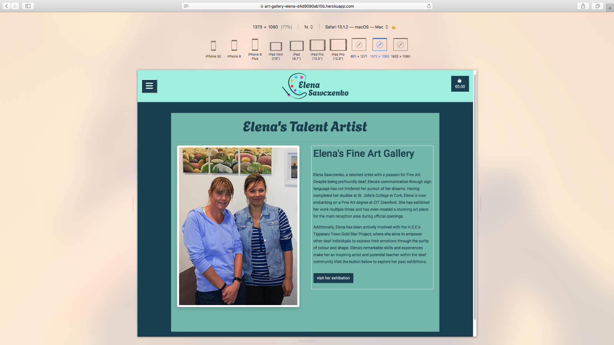
    

1. 
     

        
Click here to see Safari for tablet

        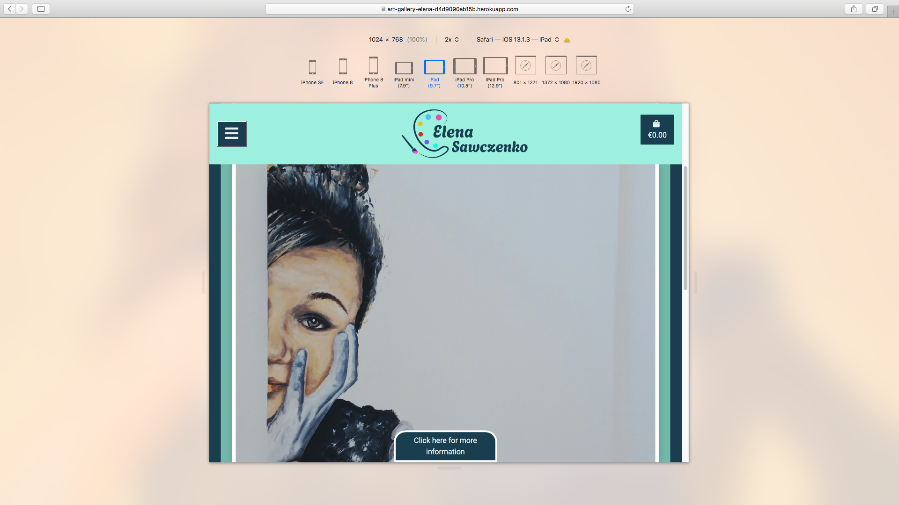
    

1. 
     

        
Click here to see Safari mobile

        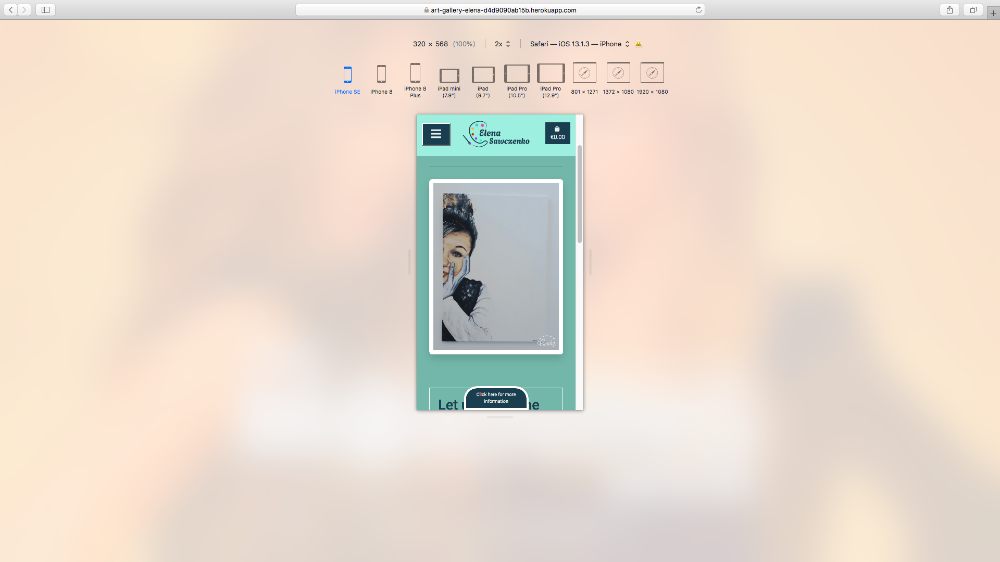
    

## The lighthouse runs testing and results.

* This [Page Speed Insights](https://pagespeed.web.dev/analysis/https-art-gallery-elena-d4d9090ab15b-herokuapp-com/3fwzmsh2yy?form_factor=desktop). is a test tool that analyzes the performance of a website on both desktop and mobile devices. It provides insights and recommendations based on the results obtained from running the test.

* The test results indicate that the mobile performance of the analyzed website is relatively low, suggesting potential areas for improvement. It has been proven to improve website results, even in cases where responsive images have caused performance issues. I have decided not to pursue further fixes due to time constraints.

* ### See attached results for both Desktop & Mobile:

1. 
     

        
Click here to see the result of Desktop performance 

        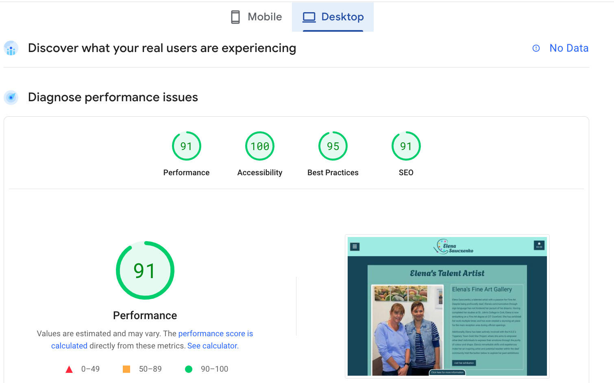
    

1. 
     

        
Click here to see the result of mobile performance 

        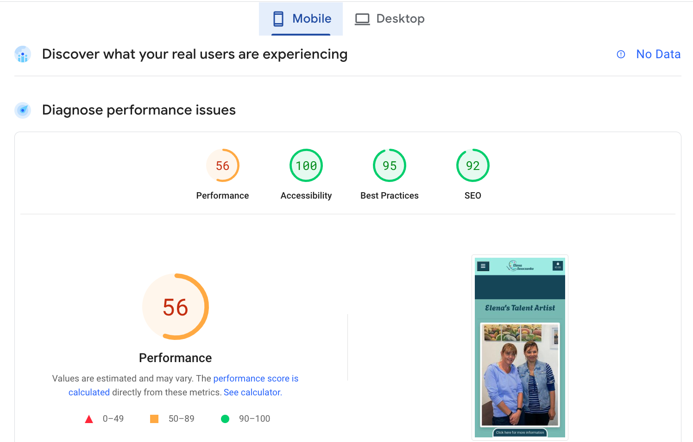
    

## Validation testing

### HTML
* Run testing using [The 3WC HTML Validator](https://validator.w3.org/) for Home, About Us, Category Painting, Shop, Search Product, The Product Management, Profile, Login, Sign-up, Logout, and Contact pages have been meticulously reviewed and corrected to ensure optimal functionality. Our overlay model login and signup buttons remain unchanged. All passed!

### CSS
* Run testing using [the official (Jigsaw) validator](https://jigsaw.w3.org/css-validator/) for CSS. It was all passed and no errors.

### Python

* [The CI Python Linter](https://pep8ci.herokuapp.com/#) is a powerful tool designed to identify and fix errors in Python code. With its extensive testing capabilities, it thoroughly scans your code and provides detailed feedback on any issues it finds. While it successfully resolves most errors, there may be a few instances where it is unable to make the necessary corrections. Additionally, there have been occasional issues with the tool causing errors when running the site. However, despite these minor setbacks, the CI Python Linter remains a reliable and effective solution for ensuring the quality and correctness of your Python code.

### The devices

* The iPhone reviewed and corrected to ensure optimal functionality and it looks good.

## Credits

*  Our concept art gallery site, designed specifically for art enthusiasts and collectors, offers a unique consulting experience tailored to their needs. Whether you're a first-time client or a close friend, our personalized approach ensures a seamless collaboration. With a focus on showcasing timeless art pieces, our gallery offers a diverse collection of old masterpieces. However, we understand the importance of staying current, and we are committed to updating and enhancing the site to meet her evolving preferences. When the time is right, we look forward to assisting you in showcasing your artwork after her busy schedule with your child.

* Please find Agile management [Consult with a client](https://github.com/RQISL/portfolio-project-5-robert-quinlan/issues/7) as you can see when we were consulted up to date. 

* Our mentor advised me where my concept can challenge and learn from mistakes, easily manage projects and avoid unnecessary complications. Take control of the development process and achieve success. It was more complicated than you expected. Also, He was an excellent tutorial with me for a few sessions. 

# Deployment

[The Heroku app page](https://www.heroku.com/) where is deployed. How do processing the site deployed as follows:

* Login 
* use the Google Authenticator app and open the screen display of the code number 
and Verify Your Identity page "Verification Code" and insert the code in the box 
then click on the Verify button. 
* Click on the button "Create new app" 
* Type in the box “project-4-order-foods”
* Select Europe
* Click on the "Create app" button
* Click "art-gallery-elena" to open
* Click on "Deploy" on the top menu
* On RQISL next to the box copy from GitHub <https://github.com/RQISL/portfolio-project-5-robert-quinlan> to paste onto the box then click on to "search" button 
* prompt shows the link active then click on the "connect" button
* Make sure to check the "Enable Automatic" button is on
* click on the "Deploy Branch" button
* Prompts are active on the screen until the completed
* Click on the "View" button to open the page

### The deployed site is now live [Art Gallery](https://art-gallery-elena-d4d9090ab15b.herokuapp.com/)

## Resource & tutorial
* ### I learned as many resources as possible I learned how to use Create for the cart, profile, and CRUD.

### Resources and tutorials:
* Most of the time I learned walkthrough at Aoutique Ado as it follows on my project 5 but mostly, I modified the way of site I created. I had quite an improved familiarity with Django and I enjoyed but it needs further experience to improve my skills in the field of Django. 

## Technologies Used

1) [Gitpod](https://gitpod.io) I have used it since the beginning of Project 5

2) [The CI Python Linter](https://pep8ci.herokuapp.com/#) is a powerful tool that allows you to run tests and identify errors in your Python code. By using this linter, you can easily fix any bugs and ensure the quality of your code. Additionally, I found [Code Beautify](https://codebeautify.org/python-formatter-beautifier#) to be extremely helpful in reducing stress and quickly identifying errors. This Python formatter and beautifier simplifies the process of finding and fixing errors. Simply copy and paste your code into the CI Python Linter, and it will highlight any errors for you to address. However, please note that some code may still have errors that cannot be changed to avoid any issues with the site.

3) [Heroku app](https://www.heroku.com/) - The deployed to activate the browser.

5) [3WC HTML Validator](https://validator.w3.org/) - Run testing for any errors to fix the bugs

6) [3WC CSS Validator](https://jigsaw.w3.org/css-validator/)  - Run testing for any errors to fix the bugs

7) [Bootstraps 5](https://getbootstrap.com/docs/5.0/getting-started/introduction/ )  - I used Bootstrap 5.

8) Adobe Illustrator - I use it to design logos.

9) Adobe Photoshop - I use it to edit images.

## Concluded 

*  Our site is the perfect place for me to learn and grow in my skills. With a user-friendly interface and a wide range of resources, I'll find everything I need to succeed.

*  Unlike Project 4, our site is designed to make learning easy and enjoyable. I'll have access to expert instructors, engaging content, and a supportive community of learners.

* Art Gallery, a concept project brought to life. Visit the site [Art Gallery](https://art-gallery-elena-d4d9090ab15b.herokuapp.com/).

